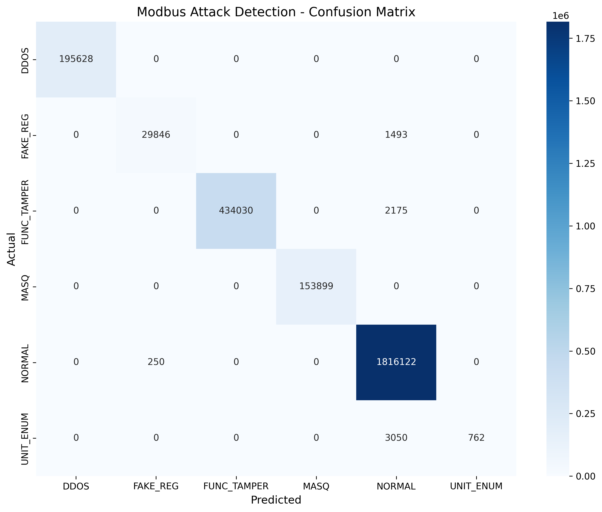

# Decision Tree Classifier 

## Overview
A decision tree classifier leveraged to detect anomalies within Modbus TCP network traffic logs. 

## Dataset
- **Training samples**: ~3.3M Network Packets
- **Validation samples**: ~2.6M Network Packets
- **Features**: 13 Features selected from 48 available
- **Classes**: 6 (Normal traffic + 5 Attack Classifications)

## Feature Selection

**IP Layer**
- `IP_len` - Packet length
- `IP_ttl` - Time to live

**TCP Layer**
- `TCP_window` - Window size
- `TCP_flags` - Control flags

**Modbus Protocol**
- `ModbusTCPRequest_func_code` - Function code
- `ModbusTCPRequest_unit_id` - Device identifier
- `ModbusTCPRequest_trans_id` - Transaction ID
- `ModbusTCPRequest_length` - Request length
- `ModbusTCPResponse_func_code` - Response function code
- `ModbusTCPResponse_length` - Response length
- `ModbusTCPResponse_trans_id` - Response transaction ID
- `ModbusReadDiscreteInputsRequest_reference_number` - Starting address (reference number) for reading discrete inputs (Modbus Function 2)
- `ModbusWriteMultipleCoilsRequest_reference_number` - Starting address (reference number) for writing multiple coils (Modbus Function 15)

## Hyperparameter Training
GridSearchCV with 5-fold cross-validation and F1-macro scoring:
- **max_depth**: [10, 20, None]
- **min_samples_split**: [10, 30, 50]
- **min_samples_leaf**: [5, 10, 20]
- **criterion**: ['gini', 'entropy']
- **class_weight**: ['balanced', None]  

## Model Architecture
```python
DecisionTreeClassifier(
    criterion='gini',
    max_depth=10,
    min_samples_split=10,
    min_samples_leaf=5,
    class_weight='balanced',
    random_state=17
)
```

## Results


### Classification Report
| Attack Type  | Precision | Recall | F1-Score | Support   |
|--------------|-----------|--------|----------|-----------|
| DDOS         | 1.00      | 1.00   | 1.00     | 195,628   |
| FAKE_REG     | 0.99      | 0.95   | 0.97     | 31,339    |
| FUNC_TAMPER  | 1.00      | 1.00   | 1.00     | 436,205   |
| MASQ         | 1.00      | 1.00   | 1.00     | 153,899   |
| NORMAL       | 1.00      | 1.00   | 1.00     | 1,816,372 |
| UNIT_ENUM    | 1.00      | 0.20   | 0.33     | 3,812     |
| **Accuracy** |           |        | **0.997358** | 2,637,255 |
| **Macro Avg**| **1.00**  | **0.86**| **0.88**| 2,637,255 |
| **Weighted Avg**| **1.00**| **1.00**| **1.00**| 2,637,255 |

**Total Errors**: 6968 out of 2637255

### Feature Importance

| Feature | Importance |
|---------|------------|
| `ModbusTCPRequest_trans_id` | 0.2016 |
| `ModbusWriteMultipleCoilsRequest_reference_number` | 0.2000 |
| `IP_len` | 0.1996 |
| `TCP_flags` | 0.1996 |
| `ModbusTCPRequest_unit_id` | 0.1977 |
| `ModbusTCPRequest_func_code` | 0.0008 |
| `TCP_window` | 0.0007 |
| `IP_ttl` | 0.0000 |
| `ModbusTCPResponse_func_code` | 0.0000 |
| `ModbusReadDiscreteInputsRequest_reference_number` | 0.0000 |
| `ModbusTCPRequest_length` | 0.0000 |
| `ModbusTCPResponse_length` | 0.0000 |
| `ModbusTCPResponse_trans_id` | 0.0000 |

### Confusion Matrix


## Key Findings
- Perfect detection of DDOS, FUNC_TAMPER, and MASQ attacks (100% Recall), as well as 95% recall of FAKE_REG attacks.
- 99.74% overall accuracy with 6968 misclassified samples out of 2.637M total samples.
- Only 20% recall of UNIT_ENUM, with the majority misclassified as NORMAL, likely due to the extremely low population of UNIT_ENUM samples (3812 out of 2.637 million).

### Lessons Learned
- GridSearch can be a valuable tool to tune hyperparameters and configure ML models without extensive manual trial-and-error. 
- The feature importance results show that the decision tree relied heavily on only a small subset of the selected features, indicating that many features contributed little to the model’s decisions.
- Decision trees classify well-represented attack types accurately, but they struggle with rare or unique classes. In this scenario, the low recall for UNIT_ENUM appears to be a result of how underrepresented it is in the dataset. 