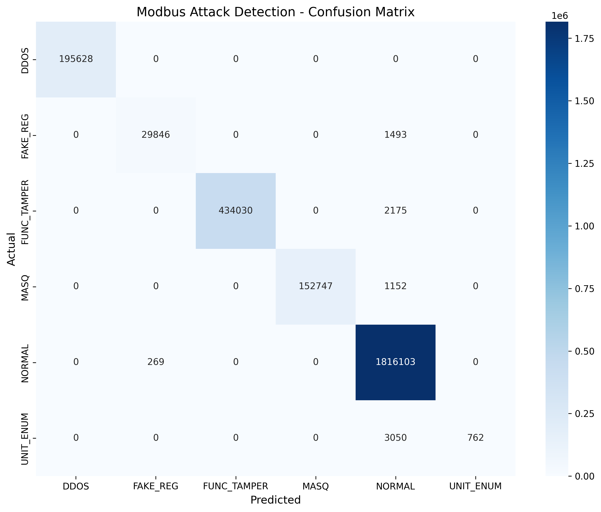

# Random Forest Classifier

## Project Overview
A random forest classifier leveraged to detect anomalies within Modbus TCP network traffic logs. 

## Model Overview
A random forest model is an ensemble approach that leverages multiple decision trees in order to make predictions. The model can be used for classification (prediction of data classes) or regression (estimating numerical values) tasks.

### Key Features
- Random features and random parts of the data are used for individual decision trees, and those results are combined via 'majority voting' for classificaation tasks. 
- The random forest approach is capable of processing large datasets and many different features due to this approach, helping to avoid overfitting and improve prediction accuracy.

## Dataset
- **Training samples**: ~3.3M Network Packets
- **Validation samples**: ~2.6M Network Packets
- **Features**: 13 Features selected from 48 available
- **Classes**: 6 (Normal traffic + 5 Attack Classifications)

## Feature Selection

**IP Layer**
- `IP_len` - Packet length
- `IP_ttl` - Time to live

**TCP Layer**
- `TCP_window` - Window size
- `TCP_flags` - Control flags

**Modbus Protocol**
- `ModbusTCPRequest_func_code` - Function code
- `ModbusTCPRequest_unit_id` - Device identifier
- `ModbusTCPRequest_trans_id` - Transaction ID
- `ModbusTCPRequest_length` - Request length
- `ModbusTCPResponse_func_code` - Response function code
- `ModbusTCPResponse_length` - Response length
- `ModbusTCPResponse_trans_id` - Response transaction ID
- `ModbusReadDiscreteInputsRequest_reference_number` - Starting address (reference number) for reading discrete inputs (Modbus Function 2)
- `ModbusWriteMultipleCoilsRequest_reference_number` - Starting address (reference number) for writing multiple coils (Modbus Function 15)

## Hyperparameter Training
GridSearchCV with 5-fold cross-validation and F1-macro scoring:
- **n_estimators**: [100, 200]
- **max_depth**: [15, 20, 30]
- **min_samples_split**: [15, 25]
- **min_samples_leaf**: [2, 5]
- **bootstrap**: [True, False]
- **class_weight**: ['balanced', None]  

## Model Architecture
```python
RandomForestClassifier(
    n_estimators=100,
    max_depth=15,
    min_samples_split=15,
    min_samples_leaf=2,
    bootstrap=True,
    class_weight='balanced',
    random_state=42
)
```

## Results


### Classification Report
| Attack Type      | Precision | Recall | F1-Score | Support     |
|------------------|-----------|--------|----------|-------------|
| DDOS             | 1.00      | 1.00   | 1.00     |     195,628 |
| FAKE_REG         | 0.99      | 0.95   | 0.97     |      31,339 |
| FUNC_TAMPER      | 1.00      | 1.00   | 1.00     |     436,205 |
| MASQ             | 1.00      | 1.00   | 1.00     |     153,899 |
| NORMAL           | 1.00      | 1.00   | 1.00     |   1,816,372 |
| UNIT_ENUM        | 1.00      | 0.20   | 0.33     |       3,812 |
| **Accuracy**     |           |        | **0.997282** |   2,637,255 |
| **Macro Avg**    | **1.00**  | **0.86** | **0.88**   |   2,637,255 |
| **Weighted Avg** | **1.00**  | **1.00** | **1.00**   |   2,637,255 |
**Total Errors**: 7,169 out of 2,637,255 (0.26% error rate)

### Feature Importance
| Feature | Importance |
|---------|------------|
| `ModbusTCPRequest_trans_id` | 0.2452 |
| `ModbusWriteMultipleCoilsRequest_reference_number` | 0.1454 |
| `ModbusTCPRequest_func_code` | 0.1206 |
| `TCP_flags` | 0.1118 |
| `ModbusTCPRequest_unit_id` | 0.1075 |
| `IP_len` | 0.0899 |
| `ModbusTCPRequest_length` | 0.0800 |
| `TCP_window` | 0.0756 |
| `IP_ttl` | 0.0120 |
| `ModbusTCPResponse_trans_id` | 0.0045 |
| `ModbusTCPResponse_func_code` | 0.0041 |
| `ModbusTCPResponse_length` | 0.0034 |
| `ModbusReadDiscreteInputsRequest_reference_number` | 0.0000 |

### Confusion Matrix


## Key Findings
- Similar to decision tree, the random forest achieved perfect recall of DDOS, FUNC_TAMPER, and MASQ attacks, and 95% recall of FAKE_REG attacks. 
- The random forest classifier achieved a 99.73% accuracy with a total error count of 7169, slightly worse than the 99.74% and 6968 errors achieved by the decision tree classifier implementation.
- UNIT_ENUM remained the most challenging and misclassified attack, with only 20% recall, indicating that the ensemble of decision trees still struggled to detect this class of attack due to its underrepresentation in the dataset.
- Additionally, due to the division of the dataset for the random forest, not every tree likely saw an even number of samples for the smaller represented attacks.
- The most important feature remained the transaction ID, however, the random forest classifier saw slight increase in importance across some of the other features.

### Lessons Learned
- Although random forests can improve performance compared to decision trees, in this case, the ensemble of trees actually decreased performance, and did not improve detection of the underrepresented class of attacks. 
- This experiment highlights that more complex models do not automatically guarantee better results, especially when the dataset severely underrepresented classifications and categories.

## References

### Technical Resources
- **Random Forest Algorithm**: GeeksforGeeks. ["Random Forest Algorithm in Machine Learning"](https://www.geeksforgeeks.org/machine-learning/random-forest-algorithm-in-machine-learning/). Accessed December 2024.
- **Feature Importance**: GeeksforGeeks. ["Understanding Feature Importance and Visualization of Tree Models"](https://www.geeksforgeeks.org/machine-learning/understanding-feature-importance-and-visualization-of-tree-models/#1-decision-tree-feature-importance). Accessed December 2024.

### Dataset
- **FARAONIC Dataset**: [Modbus TCP Cybersecurity Dataset](https://www.kaggle.com/datasets/dataset-name). Kaggle, 2024.
https://medium.com/@fraidoonomarzai99/xgboost-classification-in-depth-979f11ef4bf9